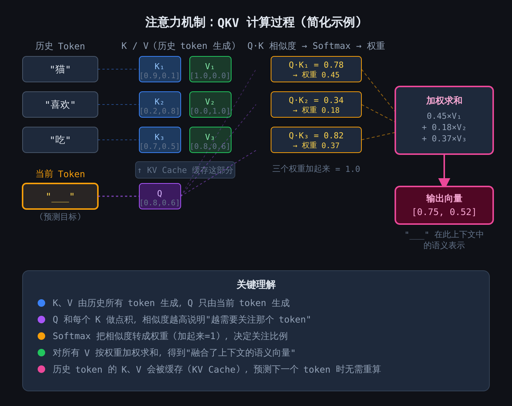
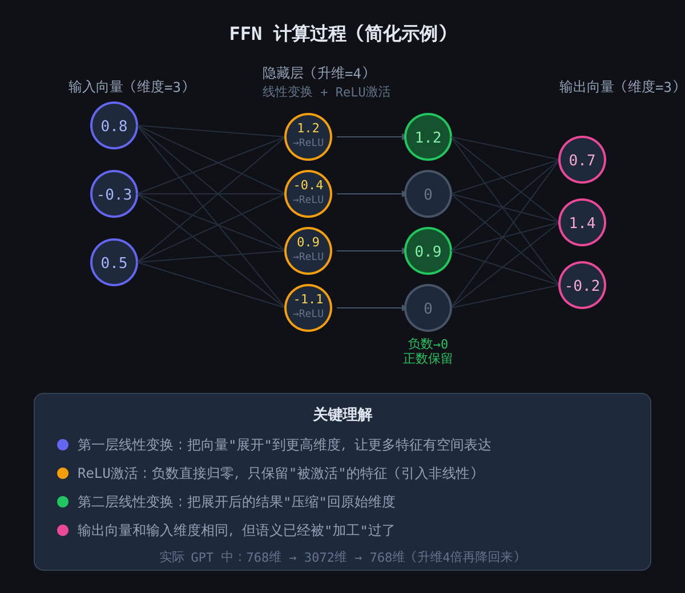
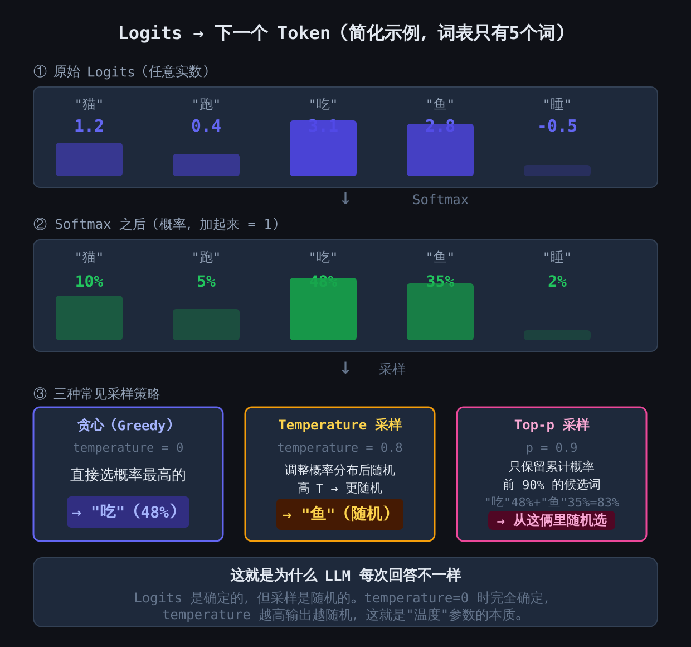

# Transformer 如何真正生成文本：可视化详解

每次你在聊天消息上点击"发送"，一个 Transformer 模型就会苏醒并完成一件了不起的事情：它审视你曾经对它说过的每一个词，权衡它们的相关性，将它们通过一个庞大的前馈网络运行，然后选出最合适的下一个 token——接着对后面的 token 一次又一次地重复这个过程，重复数百次，速度比你眨眼还快。

如果你与 LLM 打交道，确切理解这条管线如何运作不仅具有智力上的满足感——更是实际必需的。KV Cache 的内存成本、为什么长上下文很昂贵、temperature 参数的实际作用、模型为什么会产生幻觉、以及推测解码（speculative decoding）如何加速推理——一旦你理解了 Transformer 推理的四阶段架构，这些都会变得自然而然。

**阶段 1：Attention（注意力）——让每个词感知到其他每个词**

当一个 token 进入 Transformer 层时，它并不会带着对相邻 token 的任何感知。注意力机制解决了这个问题。每个 token 通过三个学习到的权重矩阵进行投影，生成三个向量：

- **Q（Query，查询）：** "我现在需要什么信息？"——当前 token 对历史的搜索查询。
- **K（Key，键）：** "这是我能提供的信息。"——每个 token 的索引条目，描述它携带了什么信息。
- **V（Value，值）：** "这是实际的内容。"——信息本身，当一个 token 被关注时传递出去的内容。

当前 token 的 Q 通过点积与每个先前 token 的 K 进行比较，产生一组原始的注意力分数。这些分数经过缩放，通过 softmax 转化为概率分布，然后用于计算所有 V 向量的加权和。结果是一个表示当前 token *以之前所有内容为条件* 的单一向量。

这里的关键优化是 **KV Cache**。在自回归生成过程中，你一次只生成一个 token。如果没有缓存，每一步都需要为所有之前的 token 重新计算 K 和 V——这是纯粹的平方级浪费。相反，一旦某个 token 的 K 和 V 计算出来，它们就被存储起来。在下一步中，只有最新 token 的 Q、K 和 V 需要重新计算；所有历史的 K 和 V 从缓存中读取。这将每步 O(n²) 的操作转变为 O(n)，这正是自回归生成能够实际可行的全部原因。

**阶段 2：FFN（前馈网络）——知识存储**

注意力机制本质上是一个加权平均操作——从根本上来说是线性的。堆叠足够多的线性操作，它们会坍缩为单一的线性变换，这无法模拟人类语言的复杂性。前馈网络（FFN）打破了这种线性。

FFN 接收注意力输出的向量（通常为 768 到 4096 维，取决于模型大小），并通过一个两层变换运行：扩展到 4 倍的维度（例如，768 → 3072），应用非线性激活函数如 ReLU 或 GELU，然后压缩回原始维度。扩展为模型提供了一个高维空间来表示复杂的特征交互；激活函数将负值归零，确保两个线性层不会坍缩为一个；压缩则映射回该层的输出格式。

有一系列引人注目的研究表明，FFN 层存储了模型大部分**事实性知识**——"巴黎是法国的首都"存在于 FFN 的权重中，而非注意力模式中。注意力负责路由信息；FFN 负责存储信息。这就是为什么模型编辑技术（如 ROME 或 MEMIT）针对 FFN 权重，以及为什么 FFN 大约占 Transformer 参数的三分之二。

**阶段 3：层层堆叠**

Attention + FFN = 一个 Transformer 块。现代模型堆叠了十几个（小型蒸馏模型）到一百多个（前沿模型）这样的块。每个块都有自己独立的三套 QKV 和 FFN 权重矩阵，一个块的输出成为下一个块的输入。

这种堆叠创建了抽象的层次结构。浅层倾向于学习表面模式——语法、词性、局部词语关系。中间层学习语义结构。深层处理抽象推理、事实整合和长距离依赖。KV Cache 必须*按层*维护：96 层、128K 上下文窗口和 128 维 KV 头的配置下，内存占用为 `96 × 128K × 128 × 2（K+V）× 2 字节（FP16）`——仅缓存就大约需要 6GB。这就是长上下文推理昂贵的原因，也是分组查询注意力（GQA）、KV 量化和滑动窗口注意力等技术不只是优化手段而是生产部署必要条件的原因。

**阶段 4：解码——从向量到词语**

在最后一个 Transformer 块之后，你得到了一个向量（比如 768 维），它在丰富的语义空间中表示最后一个 token。但你需要一个词。以下是这个过程的展开：

输出向量乘以一个反嵌入矩阵（unembedding matrix）——通常是原始 token 嵌入矩阵的转置（一种称为 Weight Tying 的技巧，可将参数量减半）——产生 **logits**：词汇表中每个 token 的原始分数。对于一个 50,000 个 token 的词汇表，这就是 50,000 个数字，代表模型对每个可能的下一个词的未经校准的偏好。

Logits 通过 softmax 转化为适当的概率分布，然后由采样策略选出实际的 token：

- **贪心解码（temperature=0）：** 总是选择概率最高的 token。确定性、可复现，但通常乏味——它倾向于生成重复、可预测的文本。
- **Temperature 采样：** 在 softmax 之前将 logits 除以一个温度值。高温度（>1）会使分布变得平坦，使稀有 token 更可能出现，输出更具创造性。低温度（<1）会使分布更尖锐，使模型更加保守。
- **Top-p（核）采样：** 按概率对 token 排序，只保留累积概率超过 p（例如 0.9）的最小集合，然后从该截断集合中采样。这会根据模型的置信度动态调整候选池——当模型确定时，候选池很小；当模型不确定时，候选池扩大。

这个采样步骤就是同一个提示词可以产生不同回复的原因——logits 是确定性的（给定相同的权重和输入），但采样*引入*了随机性。这也是幻觉得以乘虚而入的地方：如果模型将不可忽略的概率分配给一个事实上错误的 token，而采样器选中了它，模型就会自信地输出虚假信息。架构本身没有任何事实核查机制；它只知道概率分布。

**为什么这在实践中很重要**

一旦你内化了这个四阶段管线——注意力通过 KV Cache 路由信息，FFN 存储知识，多层构建抽象，解码从概率分布中采样——许多工程决策就会变得直观。你会理解为什么 KV Cache 压缩对长上下文至关重要。你会明白为什么推测解码（使用一个小型草稿模型提议 token，然后用完整模型在一次前向传播中验证）可以在不改变输出分布的情况下加速生成。你会领会为什么微调 FFN 层可以注入事实更新，同时保留风格和流畅度。你还会认识到采样参数不只是可以调节的旋钮——它们是确定性计算与创造性输出之间的接口。

**核心要点**

- 注意力为每个 token 计算 Q、K、V；Q 查询 K 以产生注意力权重，权重聚合 V 为具有上下文感知的表示。KV Cache 存储历史的 K 和 V 以避免重复计算，将每步 O(n²) 变为 O(n)。
- FFN（扩展 → 激活 → 压缩）引入非线性，据信存储了模型大部分的事实性知识，约占 Transformer 参数的 2/3。
- 堆叠多个块创建了层次结构：浅层学习语法，深层学习抽象推理。KV Cache 必须按层存储，使得缓存内存随 `层数 × 序列长度 × KV 维度` 扩展。
- 解码将最终的隐藏向量通过反嵌入矩阵转化为 logits，再通过 softmax 转化为概率，然后通过采样转化为 token。Temperature 控制随机性；top-p 动态限制候选池。
- 采样是推理中非确定性的唯一来源。当概率分布将权重分配给事实上错误的 token 而采样器选中它们时，幻觉就会发生——架构本身没有内置的事实核查机制。
